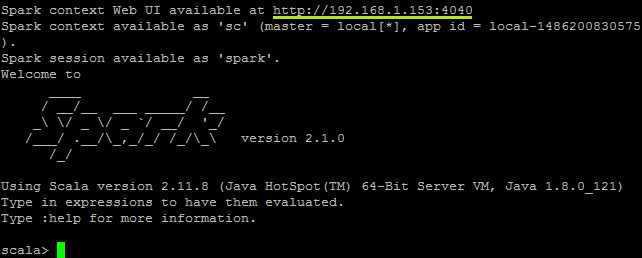

# Spark Installation on Ubuntu
Installation scripts for Apache Spark on Ubuntu

##1. Java Installation

Install JDK in the machine from Oracle Java Repository

```
sudo apt-add-repository ppa:webupd8team/java
sudo apt-get update
sudo apt-get install oracle-java8-installer
```

Check the installation by running the code
```
java -version
```

##2. Scala Installation

Install latest version of Scala using the command line

```
sudo apt install scala
```

The scala version can be confirmed by running,
```
scala -version
```

##3. Get Spark from Apache Download Page

Go to [Apache Spark Download Page](http://spark.apache.org/downloads.html) and get the package url, as follows. After that execute `wget` command with that package url.


Here, the url is `http://d3kbcqa49mib13.cloudfront.net/spark-2.1.0-bin-hadoop2.7.tgz` and the command will be

```
wget "http://d3kbcqa49mib13.cloudfront.net/spark-2.1.0-bin-hadoop2.7.tgz"
```

Next step is extracting the downloaded package using tar command.

```
tar xvf spark-2.1.0-bin-hadoop2.7.tgz
```

It's better to rename the folder as `spark` for easiness
```
mv spark-2.1.0-bin-hadoop2.7 spark
```

##4. Run the Spark

Now all the setups are completed, and Spark shell can be lauched,
```
./spark/bin/spark-shell
```

If all everything is fine, Spark shell should be started as
 


The Web UI can be browsable using the url(green underline) provided by Spark-Shell